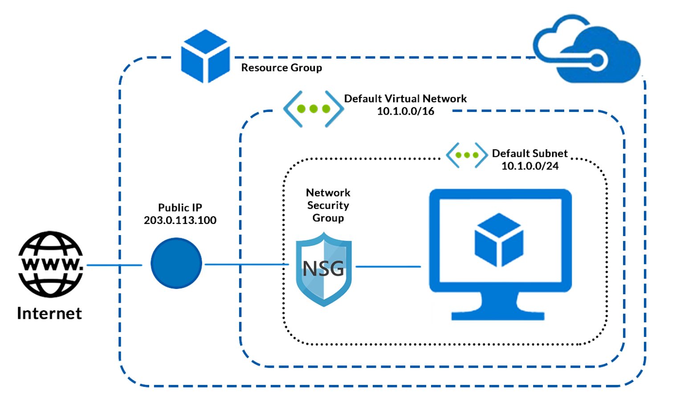

Azure Virtual Machine Deployment with Terraform
This repository contains step‑by‑step Terraform configurations to deploy an Azure Virtual Machine in Microsoft Azure.
Each stage is modular, documented, and follows best practices for clarity, governance, and scalability.

Step 1: Resource Group
resource "azurerm_resource_group" "rg" {
  name     = "rg-project-dev-southindia"
  location = var.location

  tags = {
    Owner       = "Sandeep Gaikwad"
    Environment = var.environment
    Project     = var.project_name
  }
}

📝 Notes
Purpose: Logical container for Azure resources.

Use: Organizes resources by project, environment, and region.

Best Practice: Apply tags for governance and cost tracking.

Step 2: Virtual Network & Subnet
resource "azurerm_virtual_network" "vnet" {
  name                = "vnet-${var.project_name}-${var.environment}-southindia"
  address_space       = var.vnet_address_space
  location            = var.location
  resource_group_name = azurerm_resource_group.rg.name
}

resource "azurerm_subnet" "subnet" {
  name                 = "subnet-${var.project_name}-${var.environment}-southindia"
  resource_group_name  = azurerm_resource_group.rg.name
  virtual_network_name = azurerm_virtual_network.vnet.name
  address_prefixes     = var.subnet_prefix
}

📝 Notes
Purpose: Provides private networking for the VM.

Use: Subnets allow segmentation of workloads.

Best Practice: Use non‑overlapping CIDR ranges to avoid conflicts.

| Variable | Description | Default |
| --- | --- | --- |
| ``vnet_address_space`` | CIDR range for VNet | ``10.0.0.0/16`` |
| ``subnet_prefix`` | CIDR range for Subnet | ``10.0.1.0/24`` |

Step 3: Network Security Group (NSG)
resource "azurerm_network_security_group" "nsg" {
  name                = "nsg-${var.project_name}-${var.environment}-southindia"
  location            = var.location
  resource_group_name = azurerm_resource_group.rg.name
}

resource "azurerm_network_security_rule" "ssh" {
  name                        = "allow-ssh"
  priority                    = 100
  direction                   = "Inbound"
  access                      = "Allow"
  protocol                    = "Tcp"
  source_port_range           = "*"
  destination_port_range      = "22"
  source_address_prefix       = "*"
  destination_address_prefix  = "*"
  network_security_group_name = azurerm_network_security_group.nsg.name
  resource_group_name         = azurerm_resource_group.rg.name
}

📝 Notes
Purpose: Firewall for the VM.

Use: Controls inbound/outbound traffic.

Best Practice: Only open required ports (SSH/22, RDP/3389).

Step 4: Public IP
resource "azurerm_public_ip" "pip" {
  name                = "pip-${var.project_name}-${var.environment}-southindia"
  location            = var.location
  resource_group_name = azurerm_resource_group.rg.name
  allocation_method   = "Dynamic"
}

📝 Notes
Purpose: Provides external connectivity.

Use: Required for remote access.

Best Practice: Use static IPs for production workloads.

Step 5: Network Interface (NIC)
resource "azurerm_network_interface" "nic" {
  name                = "nic-${var.project_name}-${var.environment}-southindia"
  location            = var.location
  resource_group_name = azurerm_resource_group.rg.name

  ip_configuration {
    name                          = "nic-ipconfig"
    subnet_id                     = azurerm_subnet.subnet.id
    private_ip_address_allocation = "Dynamic"
    public_ip_address_id          = azurerm_public_ip.pip.id
  }
}

📝 Notes
Purpose: Connects VM to subnet and public IP.

Use: Acts as the VM’s network card.

Best Practice: Attach NSG to NIC or subnet for security.

Step 6: Virtual Machine
resource "azurerm_linux_virtual_machine" "vm" {
  name                = "vm-${var.project_name}-${var.environment}-southindia"
  resource_group_name = azurerm_resource_group.rg.name
  location            = var.location
  size                = var.vm_size
  admin_username      = var.admin_username
  network_interface_ids = [azurerm_network_interface.nic.id]

  os_disk {
    name                 = "osdisk-${var.project_name}-${var.environment}-southindia"
    caching              = "ReadWrite"
    storage_account_type = "Standard_LRS"
  }

  source_image_reference {
    publisher = "Canonical"
    offer     = "UbuntuServer"
    sku       = "18.04-LTS"
    version   = "latest"
  }

  admin_ssh_key {
    username   = var.admin_username
    public_key = file(var.ssh_public_key_path)
  }
}

📝 Notes
Purpose: Core compute resource.

Use: Runs workloads in Azure.

Best Practice: Use SSH keys instead of passwords.

Tip: Start with small VM sizes for dev/test, scale later.

✅ Deployment Instructions
# Authenticate with Azure
az login

# Initialize Terraform
terraform init

# Preview changes
terraform plan

# Apply configuration
terraform apply

📘 Summary
This project demonstrates a modular, professional Terraform setup for deploying an Azure VM.
Each step builds on the previous one, ensuring clarity, scalability, and best practices in cloud infrastructure.

